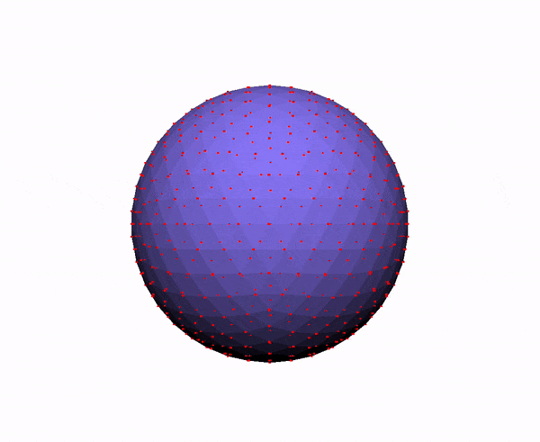

# Assignment 4: As-Rigid-As-Possible Surface Modeling (ARAP)

For this assignment, I implemented ARAP, by bouncing between solving two sparse linear systems. One for solving the rigid rotation matrix R that gets the mesh closest from position p to p'(), and one for p' that finds the min of the difference between p' and the rigid transformation of p.

For finding the R matrix for each position, I stored a P matrix for each vertex, representing all the edges from said vertex to it's neighbors, as well as a P_prime matrix which represented the new edges. I also stored a W matrix, which is the weights of each vertex's neighbors. The weights were found in my find_weights() method by finding the cotangent of the angles in each triangle that two vertices share. I used an unordered_map to map each key (the index of the neighbor within the actual list of vertices) to each value (the weight of that neighbor with respect to the vertex). All these matrices, unordered maps, etc. are stored in a Vertex struct. There is one for every vertex and their indices line up with the indices for the vertex positions vector in the move funciton. 

## Links to the starting lines of the implemenetation of the following features
- [Build the L-matrix](src/arap.cpp#L180)
- [Apply constraints](src/arap.cppL#246)
- [Precompute decomposition of L matrix](src/arap.cpp#L173)
- [Determine best-fit rotations](src/arap.cppL#154)
- [Optimize the positions](src/arap.cpp#L277)

## Results

